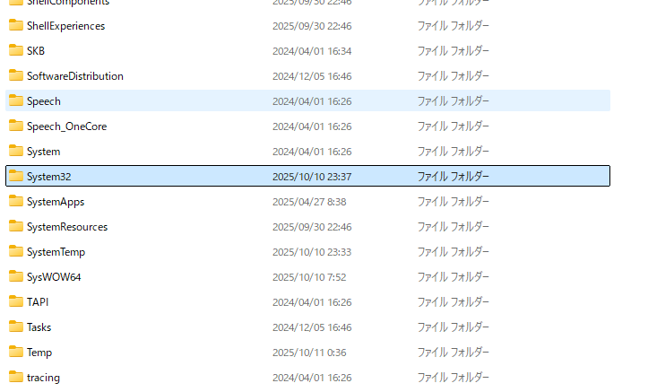
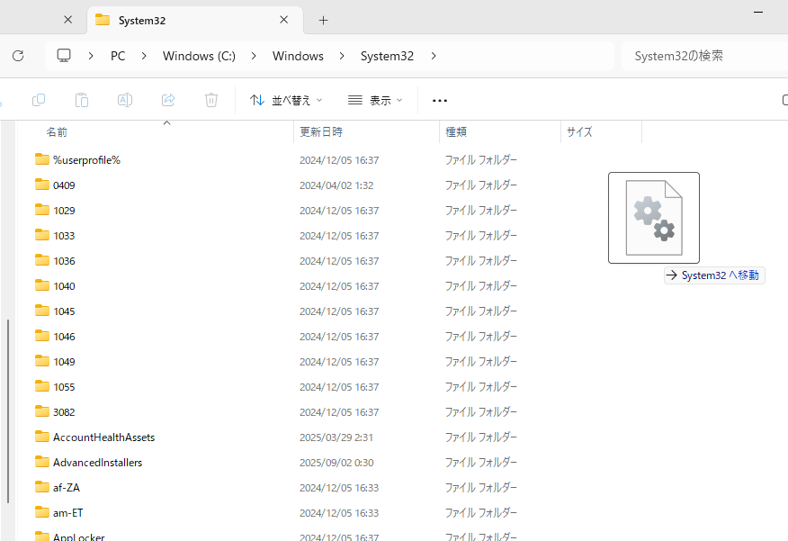
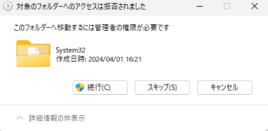
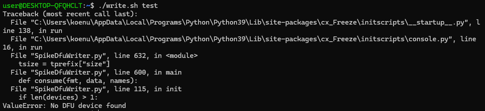

# pd_programs
こんにちは、ホッシーです．
PD実践におけるコードを記載しております
## 各コードについて
対応するフォルダをクリックすると下に説明が書いてある．課題の解説をちょくちょくおく予定

## 環境構築ができないあなたへ
**spikeへの書き込みができねぇ**というあなたへ届け  
おそらくこのようなエラーが出ていることでしょう
```bash
user@DESKTOP-QFQHCLT:~$ ./write.sh test  
Traceback (most recent call last):  
  File "C:\Users\koenu\AppData\Local\Programs\Python\Python39\Lib\site-packages\cx_Freeze\initscripts\__startup__.py", line 138, in run  
  File "C:\Users\koenu\AppData\Local\Programs\Python\Python39\Lib\site-packages\cx_Freeze\initscripts\console.py", line 16, in run  
  File "SpikeDfuWriter.py", line 632, in <module>  
    tsize = tprefix["size"]  
  File "SpikeDfuWriter.py", line 600, in main  
    def consume(fmt, data, names):  
  File "SpikeDfuWriter.py", line 113, in init  
    if not devices:  
  File "SpikeDfuWriter.py", line 443, in get_dfu_devices  
 
  File "C:\Users\koenu\AppData\Local\Programs\Python\Python39\lib\site-packages\usb\core.py", line 1309, in find  
usb.core.NoBackendError: No backend available  
```

usbのエラーとなっている方はロボットに**書き込みをできません** <br>
しかし大半の人間が解決できる方法を見つけました． 

---
### System32のdllファイルの追加
解決法は大胆かつ豪快  
System32フォルダはwindowsのシステムの根幹がそろっております．  
そのため**exeファイルを実行するシステム**もここにあります．  
我々はWSLのUbuntu環境ですがwindowsのexeファイルを実行するためここに**libusb-1.0.dll**を置くことでデバイスを完全にあてに行きます．※実行環境のパスがしっかりとSystem32に入っていることを確認．  
また、ここにはwindowsシステムの**心臓部**ですので、遊び半分で<span style="color:red;">**絶対に指示以外のことをしないでください**</span>場合によってはwindowsと永遠の別れをすることになるでしょう．  
  
以下のフォルダに[libusb-1.0.dll（公式配布ページ）](https://github.com/libusb/libusb/releases)を置いてください  
この時、我々はpython3.9を使うため64ビットである**MinGW64**の中にあるものを使うこと．

```bash
C:\Windows\System32\libusb-1.0.dll
```
その後、Ubuntuを起動  
```bash
user@DESKTOP-QFQHCLT:~$ ./write.sh test  
Traceback (most recent call last):  
  File "C:\Users\koenu\AppData\Local\Programs\Python\Python39\Lib\site-packages\cx_Freeze\initscripts\__startup__.py", line 138, in run  
  File "C:\Users\koenu\AppData\Local\Programs\Python\Python39\Lib\site-packages\cx_Freeze\initscripts\console.py", line 16, in run  
  File "SpikeDfuWriter.py", line 632, in <module>  
    tsize = tprefix["size"]  
  File "SpikeDfuWriter.py", line 600, in main  
    def consume(fmt, data, names):  
  File "SpikeDfuWriter.py", line 115, in init  
    if len(devices) > 1:  
ValueError: No DFU device found  
```
**ValueError**が出ればOKデス．本体さえあれば書き込めます．


## 画像がないとわからないよというあなたへ

パスとかよくわかんないし怖いというあなたへ
まずエクスプローラーを開きます  
その後、windows（C：）を選択します．  
　　

その中にはwindowsというフォルダがあるためそれをクリック  


次にSystem32というフォルダに入る  
  

そこのフォルダに[libusb-1.0.dll（公式配布ページ）](https://github.com/libusb/libusb/releases)をぶち込む　　


本当にいいですかと言われるが問題ないため**続行**をクリック  


その後、Ubuntuを起動
```bash
./write.sh <アプリ名>
```

これで書き込みを開始する．この際、**ValueError**が出れば成功です。本体さえあれば書き込めます．



---
## 最後に
私はこのPDに苦しんでいる人が多いと考え、このリポジトリを作った．<br>
この場所には環境構築でのUSB関連の対処を伝授したが難関はこれだけではないだろう．<br>
今後も私はこのリポジトリを更新しPDに出る**課題の回答を解説**を置こうと思う．<br>
上にあるのフォルダをクリックすると解説と答えを見ることができる．(LCD_S3とか)


もう気づいてると思うが、で無ra先生と同じことをしている．<br>
最後にこの情報が誰かの役に立っていることを祈っている．良い一日を　by Hosshi  

