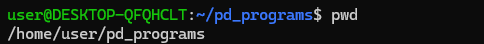
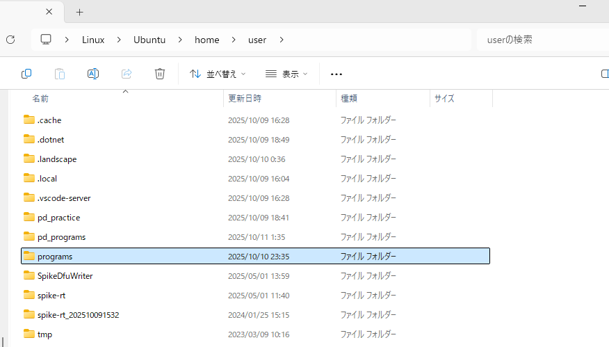

# Linux（Ubuntu）コマンド
## なんで
今回のPDでやったこともない**Ubuntu**を使う羽目になってしまった方々のために  
PDでつかうコマンドともに**基本的なコマンド**を記載します．専用の辞書代わりにどうぞ  

## Ubuntuって？
windows11やmacOSと同じ**OS**となっております．PDでは何とWindows11というOSの中にもう一つUbuntuというOSを入れるといういかれたことをしております．  
また我々は普段、マウス操作などを使う**GUI操作**をしていますが、今回のＰＤでは**CUI操作(コマンド操作)**というキーボードだけで完結する操作をしなければならない． 

## パスを理解しなければならない
マイコンプログラミングではパスについて学びましたね  
コマンド操作を行うには**パスへの理解が必須**となっているため頭に叩き込むと良いでしょう． 
**絶対パス**とか**相対パス**とか  
違いがわからない場合は**絶対パス**だけは覚えよう
  
例えばprogramsフォルダのパスは
Ubuntuの画面  CUIでの表示  
２段目に書いているものが**絶対パス**  


エクスプローラーでいうと 青くなっている部分  GUI表示


上の部分を見るとしっかりと　home > user となっておりしっかりとCUI側と同じなのがわかる．  

### しかしここでうざいことが一つ  

ふざけていることに普段使っているwindows11とPDでつかうUbuntuでパスの指定が少し違います．  
windows11の場合  
```bash
C:\Users\tossh\OneDrive\デスクトップ\exe>
```

Ubuntu  
```bash
~/programs/LCD_S3  
#もしくは  
/home/user/programs/LCD_S3
```

このようにwindows11では**バックスラッシュ**、Ubuntuでは**スラッシュ**を使ってディレクトリ（フォルダ）を指定しています.  
今回はUbuntuでコマンド操作をするため下側のスラッシュがあるほうを覚えよう．  

---
## コマンド（基本）
