# Linux（Ubuntu）コマンド
## なんで
今回のPDでやったこともない**Ubuntu**を使う羽目になってしまった方々のために  
PDでつかうコマンドともに**基本的なコマンド**を記載します．専用の辞書代わりにどうぞ  

## Ubuntuって？
windows11やmacOSと同じ**OS**となっております．PDでは何とWindows11というOSの中にもう一つUbuntuというOSを入れるといういかれたことをしております．  
また我々は普段、マウス操作などを使う**GUI操作**をしていますが、今回のＰＤでは**CUI操作(コマンド操作)**というキーボードだけで完結する操作をしなければならない． 

## パスを理解しなければならない
マイコンプログラミングではパスについて学びましたね  
コマンド操作を行うには**パスへの理解が必須**となっているため頭に叩き込むと良いでしょう． 
**絶対パス**とか**相対パス**とか  
違いがわからない場合は**絶対パス**だけは覚えよう
  
例えばprogramsフォルダのパスは
Ubuntuの画面  CUIでの表示  
２段目に書いているものが**絶対パス**  


エクスプローラーでいうと 青くなっている部分  GUI表示


上の部分を見るとしっかりと　home > user となっておりしっかりとCUI側と同じなのがわかる．  

### しかしここでうざいことが一つ  

ふざけていることに普段使っているwindows11とPDでつかうUbuntuでパスの指定が少し違います．  
windows11の場合  
```bash
C:\Users\tossh\OneDrive\デスクトップ\exe>
```

Ubuntu  
```bash
~/programs/LCD_S3  
#もしくは  
/home/user/programs/LCD_S3
```

このようにwindows11では**バックスラッシュ**、Ubuntuでは**スラッシュ**を使ってディレクトリ（フォルダ）を指定しています.  
今回はUbuntuでコマンド操作をするため下側のスラッシュがあるほうを覚えよう．  
パスは経験なのでゆっくりと覚えていきましょう．  

---

## コマンド（基本）
ここからはUbuntuでよく使う基本コマンドを紹介します。
「ターミナル（黒い画面）」に**直接入力**して使います。  
コマンドを使う際は**全角スペース**は使わないでね．**半角スペース**を使うこと  

### ls（フォルダの中身を見る）  
```bash
ls
```

現在いる**フォルダ（カレントディレクトリ）**の中にあるファイル・フォルダを**一覧表示する**．なんだかんだで一番使う．


例：  
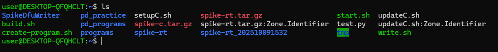


便利なオプション：  

|コマンド	|意味|
| --- | --- |
|ls -l	|詳細表示（サイズ・更新日時など）{地味に使う}|
|ls -a	|隠しファイルも表示 {あんま使わん}|
|ls -la	|両方表示　{調べて初めて知った}|


### cd（フォルダを移動する）
```bash
cd <フォルダ名>
```
cdの後にある**フォルダの中に移動**する．移動したら青色の文字でフォルダ名がユーザー名の後に付く  
移動したら当然そこが**カレントディレクトリ**となります．

例：  
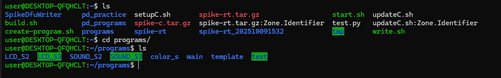

今いる場所から programs フォルダの中に移動します。

戻りたいときは：  
```bash
cd ..
```

**一つ上**のフォルダに戻れます。(相対パス)  

一気にそのフォルダへ行く：  
```bash
cd /home/user/programs/test
```
このようにパスで指定すると一気にその場所まで行ってくれます．また**相対パス**と**絶対パス**の両方使えます．  

ホームディレクトリまで一気に：  
```bash
cd
```
cdだけを入力し実行すると**ホームディレクトリまで一気に**戻れます．(~ もしくは　/home/user)  
これはよく使う．  


### pwd(現在のパスを確認したいとき)
```bash
pwd
```

現在**絶対パス**を表示してくれます。  
あまり使いませんが**パスを理解できないうちは使っていく**と良いでしょう．  

例：  
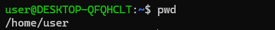

### mkdir（新しいフォルダを作る）
```bash
mkdir <新しいフォルダ名>
```

例：  
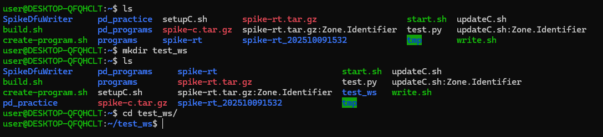

test_wsという名前の**フォルダが作成**されます。  

一気に階層を作りたい場合：  
```bash
mkdir -p a/b/c
```

**a の中に b、その中に c** を**まとめて**作ってくれます。  
わかりやすくすると:  
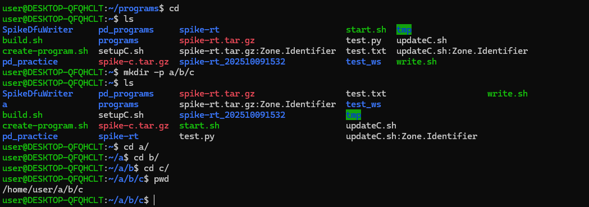

### touch(ファイル作成)
空のファイルを作成します．  
PDではあんまり使わないだろう．  
```bash
touch <ファイル名>
```

例：  
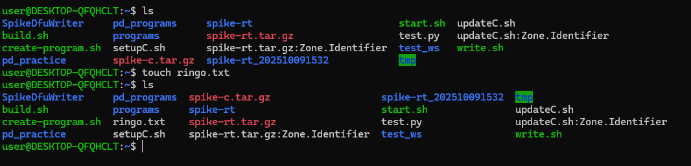
このようにringo.txtができてることがわかる．


### rm（ファイルやフォルダを削除）

注意：削除したものは「ゴミ箱に行きません」。**完全に消えます**。  
そのためあまりわからない人はこのコマンドを使わないことを推奨  

```bash
rm <ファイル名>
```

例：  
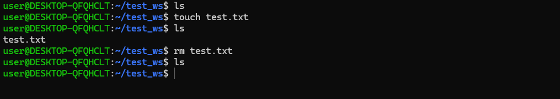


test.txt を削除。lsで見るとしっかり**消えている**ことがわかる．  

フォルダごと削除する場合：
```bash
rm -r <フォルダ名>
```

rmだけだとファイルしか消えませんが，-r は「中身ごと全部削除」できます．

### cp（コピー）
エクスプローラでやっていたコピーできます．  
```bash
cp <コピー元> <コピー先>
```

使い方がわかりにくいので例を見るといいでしょう．  

例：  
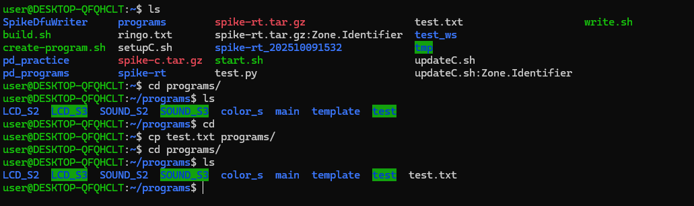

test.txt の内容をprogramsの中に**コピー**します。

フォルダごとコピーしたい場合：
```bash
cp -r <コピーしたいフォルダ> <コピー先>
```
例：  
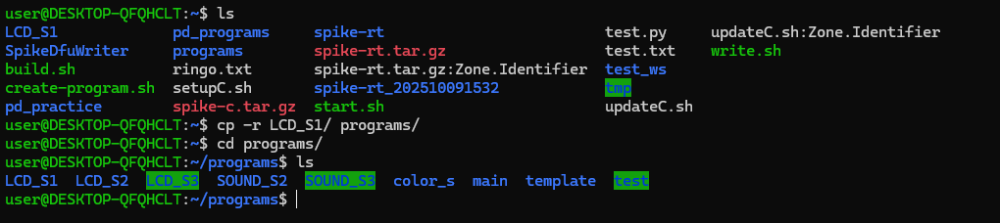

Demura先生のフォルダをコピーできました．

### mv（移動 or 名前変更）
フォルダやファイルを移動できる．  

```bash
mv <移動元> <移動先>
```

例：  
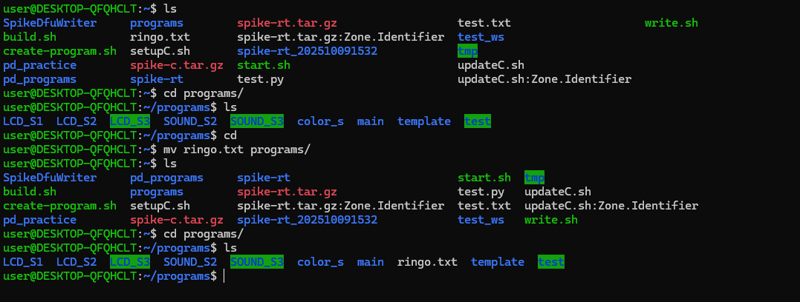

ringo.txt を programs フォルダに移動します。

名前を変える：
```bash
mv ringo.txt hosshi.txt
```

ファイル名がringo.txtからhosshi.txtに変更されます。


### cat（中身を見る）
```bash
cat <ファイル名>
```


例：  
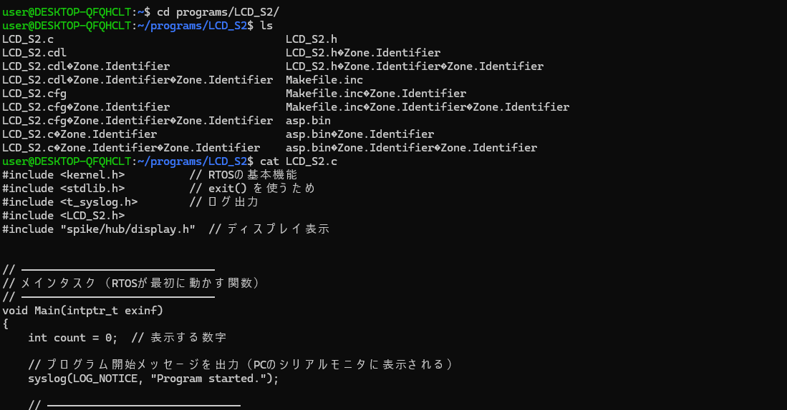


LCD_S2.c の中身をターミナル上に表示します。  
長すぎて写真に収めらなかった  

短いテキストファイルを確認するときに便利です。  
ターミナル内だけで確認できるのでエディタを開くのが面倒な時に有効  

### clear（画面をきれいに）
```bash
clear
```

例：  
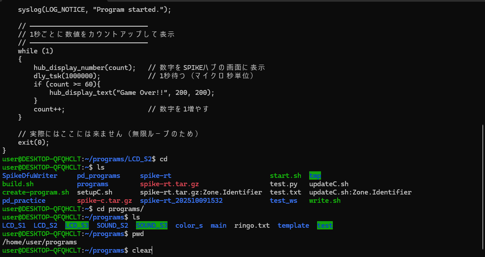

上のこれが  

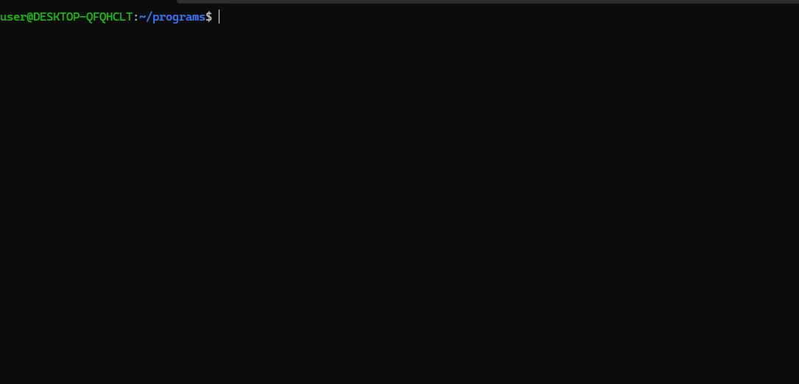

ターミナルの表示をリセットしてスッキリさせます。
特に動作に影響しないが見にくいなと思った時に使うといい  


### exit（Ubuntuを閉じる）
```bash
exit
```
Ubuntuのターミナルを終了します。

また**docker(漂白された文字)**の状態はdockerのみが終了します．  
  
最初は「ls」「cd」「mkdir」あたりを重点的に練習するといいですよ。  

---

## コマンド（PD専用に使うコマンドと解説）

PDでは**基本的なもの以外にも使うコマンド**が存在する．  
ロボットのプログラム書き込みに使うものです  
我々は〇〇.shというファイル（bashファイル）をつかって**ビルド**と**書き込み**をします．  
bashファイルとはコマンドを一気に起動するために作られたファイルです．  

### Dockerについて (start.sh)
start.shというものを起動してdockerをスタートさせています．  
```bash
./start.sh
```

これでDockerを開始できます．開始すると少し時間がたったのち文字が漂白されます．  
今回のDockerにはおそらくアプリケーションを作るために**必要なもの**が存在しています  
つまりdockerを起動しなければアプリケーションを作れないということ。  
以下の表にbashファイルの使えるときを記載します．  

|start.shあり|start.shなし|
|---|---|
|create-program.sh|start.sh|
|build.sh|write.sh|

### アプリケーション作成 (create-program.sh)
アプリケーションを作ることができる．  
```bash
./create-program.sh <作るアプリケーションの名前>
```
例：  


このようにするとアプリケーションを作ることができます．  
作ったアプリはprogramsに存在します．  
今回はhosshiという名前で作りました．

### アプリケーションの中身を編集（nano(vim) メモ帳 VScode etc..カード）
作ったアプリケーションはprogramsフォルダにあると  

作ったフォルダにアクセスすると〇〇.cというC言語専用のファイルがある  
これを**編集する**ことでプログラムを組んでいく  
私の知る中で3種類程度の方法があります．

1.メモ帳  
なじみやすい方法．ただし使いにくい．  
使い方：  
まずコマンドで編集したいアプリのフォルダまで移動しエクスプローラーで開く．  


次に〇〇.cを見つけメモ帳を選択する．  
この時，メモ帳以外に使いたいエディタがあるならそれでいい．  


好きな風に編集する．  


2.nano(vim)エディタを使う． 
エクスプローラーを開かず，ターミナル内で編集する**上級者向け**の方法．
```bash
nano <編集したいファイル>
#もしくは
vim <編集したいファイル>
```
初心者はnanoエディタをお勧めする．  
私はこれだけでプログラムを組むことができり人たちは化け物だと思ってる．  
ふつうは簡単に修正したいときに使う．  
例：  


実行すると…  


3.VScodeを使う．
プログラマーの御用達を使う．  
※[VScode](https://code.visualstudio.com/Download)をあらかじめWindowsでダウンロードしないといけない．　　


また、１年生のC言語に使っていた**Visual Studio 2022**とは**別物**である．  
```bash
code <開きたいファイル>
```
初回起動はUbuntuにVScodeをダウンロードしないといけないため**学内ネット以外**のところでつかおう．  
また，  
```bash
code .
```
これでカレントディレクトリを開くことができる
例：  


VScodeを開くと  


私が思う一番使いやすい方法である．  
ポケモンと同じで好きな方法を選ぼう．  

### バイナリデータを作る (build.sh)
何やってんのかわからないランキング第１位  
